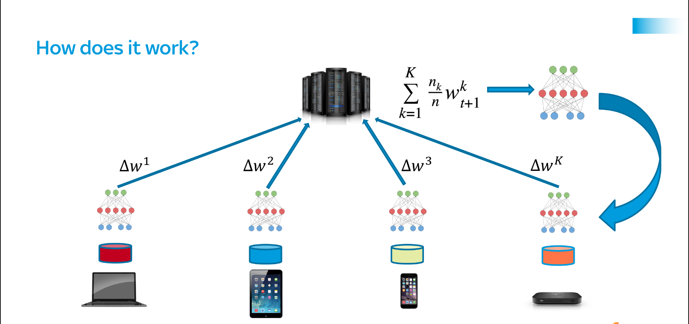
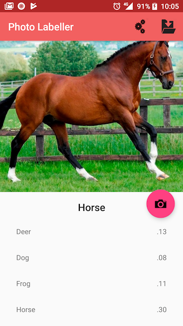
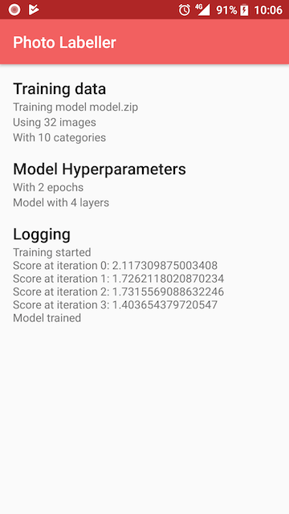

# Federated Learning
This project is an implementation of a [Federated Learning](https://research.googleblog.com/2017/04/federated-learning-collaborative.html) system consisting on a [Parameter Server](https://github.com/mccorby/PhotoLabellerServer) and an [Android application](https://github.com/mccorby/PhotoLabeller) that can be used as a client

Both components are implemented in Kotlin using DL4J as the Machine Learning framework


Enjoy!

## The problem
Training a machine learning model requires data. The more we have, the better (well... not always, but let's allow some simplifications). However, data is not cheap and more importantly, it can contain sensitive and personal information.

Recent developments in privacy in the form of new laws as [GDPR](https://www.eugdpr.org/) and the increase of awareness of users and citizens in the value of their data is generating a need for techniques to enforce more privacy

Though techniques as [anonymisation](https://ico.org.uk/for-organisations/guide-to-data-protection/anonymisation/) can greatly help with the privacy issue the fact that all the data is being sent to a central location to train the machine learning models is always a motive to be worried about


## Federated Learning as a solution to privacy
Federated Learning turns the update of Machine Learning models upside-down by allowing the devices on the edge to participate in the training.

Instead of sending the data in the client to a centralised location, Federated Learning sends the model to the devices participating in the federation. The model is then re-trained (using [Transfer Learning](http://ruder.io/transfer-learning/)) with the local data

And the data, your data, never leaves the device, let that be your phone, your laptop or your IoT gadget

## High-level Architecture



Very briefly the process of training a model goes as follows:
* The server opens a new round of training
* The clients that are going to participate in the training round download the latest version of the model from the server
* Using their local data, each client updates the model
* Those updates are sent to the server
* The server gathers all updates and applies Federated Averaging to improve the shared model
* The shared model is now ready for all clients to use

## Use Case. Classifying and training images

To demonstrate how Federated Learning works, I have implemented a system based on Cifar-10, a well-known image classification dataset

### Android client

|  |  |

#### Client Architecture

The architecture allows to remove the UI bit in Android and apply the rest with little effort to another type of client that supports Kotlin

### Parameter Server
#### Server Architecture
#### Federated Averaging
The averaging is done by the server once it has received a minimum number of updates. It applies Federated Averaging as defined in [1]()

See [FederatedAveragingStrategy.kt](https://github.com/mccorby/PhotoLabellerServer/blob/master/server/src/main/kotlin/com/mccorby/photolabeller/server/core/FederatedAveragingStrategy.kt)

```java
    override fun processUpdates(): ByteArrayOutputStream {
        val totalSamples = repository.getTotalSamples()
        val model = ModelSerializer.restoreMultiLayerNetwork(repository.retrieveModel())
        val shape = model.getLayer(layerIndex).params().shape()

        val sumUpdates = repository.listClientUpdates().fold(
                Nd4j.zeros(shape[0], shape[1]),
                { sumUpdates, next -> processSingleUpdate(next, totalSamples, sumUpdates)
        })

        model.getLayer(layerIndex).setParams(sumUpdates)
        val outputStream = ByteArrayOutputStream()
        ModelSerializer.writeModel(model, outputStream, true)
        repository.storeModel(outputStream.toByteArray())
        return outputStream
    }
 ```

## References
* [Federated Learning](https://research.googleblog.com/2017/04/federated-learning-collaborative.html)
* [OpenMined](https://www.openmined.org/)